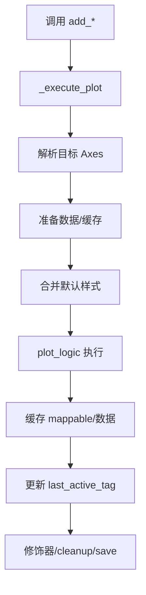

# PaperPlotter 技术文档（v0.1.7）

## 1. 项目概述

### 项目名称与版本
- 名称：PaperPlotter
- 版本：0.1.7

### 项目简介
PaperPlotter 是一个面向科研论文图表制作的声明式绘图库，对 Matplotlib 进行结构化封装，提供统一的布局管理、数据准备、样式控制与后处理能力。通过可读性极高的链式 API，用户可以快速搭建复杂的网格/马赛克/嵌套布局，在同一画布上组合多种图表类型，并使用统一的颜色与图例管理、共享坐标轴、自动标注与收尾工具，将分散的绘图细节收敛到简洁一致的工作流中。PaperPlotter 强调工程化的可维护性，让通用绘图逻辑复用到不同图表类型上，使图的复现、审稿修改与团队协作更加顺畅。

### 主要功能特性
- 统一的绘图工作流：所有绘图 API 通过 `_execute_plot` 统一处理布局、数据准备、默认样式、缓存与状态。
- 灵活布局：简单网格、马赛克、嵌套子网格；支持自动标注与组合边框。
- 多图类型：折线、散点、柱状、热图、统计图，以及新增的 10 类图表（见使用说明）。
- 颜色一致性：`ColorManager` 基于系列 `label` 在多子图间保持颜色稳定。
- 双轴支持：`twinx` 与极坐标 `add_polar_twin`，并合并主/孪生轴图例。
- 收尾工具：统一图例、共享坐标、自动对齐标签、保存时延迟绘制。

### 技术栈说明
- Python 3.8+
- Matplotlib, NumPy, Pandas, Seaborn, SciPy, adjustText

---

## 2. 安装指南

### 系统要求
- Python：3.8 及以上
- 操作系统：Windows、Linux、macOS
- 显示后端：建议使用非交互式后端进行批量生成（如 `Agg`）

### 依赖安装步骤
- 使用虚拟环境（推荐）：
```
python -m venv .venv
# PowerShell
.venv\Scripts\activate.ps1
# CMD
.venv\Scripts\activate.bat
```
- 安装依赖：
```
.\.venv\Scripts\pip.exe install -r requirements.txt
```

### 环境配置说明
- Windows 默认 Python 可能为空壳，请使用项目自带虚拟环境的解释器：
```
.\.venv\Scripts\python.exe -c "import paperplot as pp; print('ok')"
```
- 运行示例脚本时，示例会自动注入项目根目录到 `sys.path`，保证 `import paperplot` 成功。

### 初始化设置
- 选择样式并创建绘图器：
```
from paperplot import Plotter
p = Plotter(layout=(1,1), style='marin_kitagawa')
```

---

## 3. 使用说明

### 核心功能操作流程
1. 创建 `Plotter`，指定布局（网格/马赛克/嵌套）。
2. 通过 `add_*` 系列方法绘图（统一走 `_execute_plot` 流程）。
3. 使用修饰器方法（标题、轴标签、图例、共享坐标等）。
4. 使用 `cleanup` 收尾，调用 `save` 输出图片。

```
from paperplot import Plotter
import pandas as pd

layout = [['A','B'],['C','C']]
df = pd.DataFrame({'x':[1,2,3], 'y':[2,3,4]})
(
  Plotter(layout=layout)
  .add_line(data=df, x='x', y='y', tag='A', label='series-1')
  .set_title('Demo', tag='A')
  .set_legend('A')
  .cleanup(align_labels=True)
  .save('demo.png')
)
```

### 配置参数说明（核心）
- `Plotter(layout, style='...', figsize=None, subplot_aspect=None, ax_configs=None, layout_engine='constrained')`
  - `layout`：`(rows, cols)`、马赛克 `List[List[str]]` 或嵌套 `dict`。
  - `style`：样式名，对应 `paperplot/styles`。
  - `ax_configs`：按 tag 指定 `projection='polar'` 等。
- 通用绘图方法遵循：`add_xxx(data=df, ..., tag='TAG')` 并通过 `_execute_plot` 实现统一流程。

### 典型使用场景示例
- 多系列分组柱状图：
```
plotter.add_grouped_bar(data=df, x='cat', ys=['s1','s2','s3'], labels={'s1':'A','s2':'B','s3':'C'}, tag='bar').set_legend('bar')
```
- 多线折线图：
```
plotter.add_multi_line(data=df, x='x', ys=['y1','y2'], labels={'y1':'LineA','y2':'LineB'}, tag='ml').set_legend('ml')
```
- 堆叠柱状图：
```
plotter.add_stacked_bar(data=df, x='cat', ys=['part1','part2','part3'], tag='stack').set_legend('stack')
```
- 极坐标柱状图与双轴：
```
plotter = Plotter(layout=[['P']], ax_configs={'P': {'projection':'polar'}})
plotter.add_polar_bar(data=df, theta='theta', r='r', tag='P', label='A')
plotter.add_polar_twin('P').add_polar_bar(data=df, theta='theta', r='r2', label='B')
plotter.target_primary('P').set_legend('P')
```
- 阶梯瀑布图：
```
plotter.add_waterfall(data=df, x='stage', deltas='delta', baseline=0.0, tag='wf')
```
- 饼/环/嵌套环图：
```
plotter.add_pie(data=df, sizes='sizes', labels=['A','B','C'], tag='pie')
plotter.add_donut(data=df, sizes='sizes', labels=['A','B','C'], width=0.4, tag='donut')
plotter.add_nested_donut(outer={'data':df_o,'sizes':'sizes'}, inner={'data':df_i,'sizes':'sizes'}, tag='nd')
```
- K 线图：
```
plotter.add_candlestick(data=df, time='t', open='open', high='high', low='low', close='close', tag='k')
```

### 命令行参数（如适用）
- 运行全部示例：
```
.\.venv\Scripts\python.exe run_all_examples.py
```
- 运行单个示例：
```
.\.venv\Scripts\python.exe examples\Chart_Types\chart_types_example.py
```

---

## 4. 开发指南

### 项目目录结构说明
```
plotter/
  paperplot/            # 核心库
    mixins/             # 图表与修饰方法分类
    styles/             # 样式文件
    core.py             # Plotter 实现
    utils.py            # 通用工具与 ColorManager
  examples/             # 示例脚本与生成图
  tests/                # 单元测试
  run_all_examples.py   # 批量运行示例
  pyproject.toml        # 项目元数据与依赖
```

### 代码规范要求
- 新增绘图 API 必须通过 `_execute_plot` 封装，避免重复逻辑。
- 以 `data=df + 列名字符串` 为首选输入方式，确保缓存与后续修饰器可用。
- 为每个公共方法编写完整的中文 docstring，包含参数、返回值、示例。
- 颜色与图例：使用 `label` 触发 `ColorManager`，通过 `set_legend` 合并主/孪生轴图例。

### 构建和测试方法
- 运行测试：
```
.\.venv\Scripts\python.exe -m pytest -q
```
- 批量示例生成：
```
.\.venv\Scripts\python.exe run_all_examples.py
```

### 贡献指南
- 提交前请确保新增/修改的 API 均走 `_execute_plot` 流程并提供示例。
- 为新增功能补充单元测试与示例 PNG。
- 在 `doc/changelog.md` 更新版本历史与变更摘要。

---

## 5. API 参考（分组）

### Core Plotter
- `Plotter(layout, style='marin_kitagawa', figsize=None, subplot_aspect=None, ax_configs=None, layout_engine='constrained', **fig_kwargs)`
- `get_ax(tag)` 按标签获取子图轴对象
- `get_ax_by_name(name)` 在马赛克/嵌套布局中按名称获取轴

### GenericPlotsMixin（通用绘图）
- `add_line(data?, x, y, tag?, ax?, **kwargs)` 折线图
- `add_bar(data?, x, y, y_err?, tag?, ax?, **kwargs)` 柱状图（支持误差条）
- `add_grouped_bar(data, x, ys, labels?, width?, yerr?, tag?, ax?, **kwargs)` 分组柱
- `add_multi_line(data, x, ys, labels?, tag?, ax?, **kwargs)` 多折线
- `add_stacked_bar(data, x, ys, labels?, width?, tag?, ax?, **kwargs)` 堆叠柱
- `add_polar_bar(data, theta, r, width?, bottom?, tag?, ax?, **kwargs)` 极坐标柱（轴需 polar）
- `add_pie(data, sizes, labels?, tag?, ax?, **kwargs)` 饼图
- `add_donut(data, sizes, labels?, width?, radius?, tag?, ax?, **kwargs)` 环图
- `add_nested_donut(outer={data,sizes,labels?}, inner={data,sizes,labels?}, tag?, ax?, **kwargs)` 嵌套环
- `add_waterfall(data, x, deltas, baseline?, colors?, connectors?, width?, tag?, ax?, **kwargs)` 瀑布图
- `add_candlestick(data, time, open, high, low, close, width?, up_color?, down_color?, tag?, ax?, **kwargs)` K 线图
- `add_scatter(data?, x, y, s?, c?, tag?, ax?, **kwargs)` 散点图（`s`/`c`支持列名）
- `add_hist(data?, x, tag?, ax?, **kwargs)` 直方图
- `add_box(data?, x, y, hue?, tag?, ax?, **kwargs)` 箱线图（Seaborn）
- `add_heatmap(data, tag?, ax?, cbar?, **kwargs)` 热图，智能匹配 `cmap`
- `add_seaborn(plot_func, data?, x?, y?, hue?, tag?, ax?, **kwargs)` 任意 Seaborn 绘制入口
- `add_blank(tag?)` 空白占位（关闭坐标轴）
- `add_regplot(data?, x, y, tag?, ax?, scatter_kws?, line_kws?, **kwargs)` 回归拟合+散点
- `add_conditional_scatter(data?, x, y, condition, tag?, ax?, **kwargs)` 条件高亮散点

### DomainSpecificPlotsMixin（领域绘图）
- `add_spectra(data?, x, y_cols, offset?, tag?, ax?, **kwargs)` 多光谱垂直偏移对比
- `add_concentration_map(data, tag?, ax?, cbar?, xlabel?, ylabel?, **kwargs)` 浓度/Mapping 热图
- `add_confusion_matrix(matrix, class_names, normalize?, tag?, ax?, **kwargs)` 混淆矩阵
- `add_roc_curve(fpr, tpr, roc_auc, tag?, ax?, **kwargs)` ROC 曲线（多分类）
- `add_pca_scatter(data?, x_pc, y_pc, hue?, tag?, ax?, **kwargs)` PCA 散点（Seaborn）
- `add_power_timeseries(data, x, y_cols, events?, tag?, ax?, **kwargs)` 电力仿真时序+事件标记
- `add_phasor_diagram(magnitudes, angles, labels?, angle_unit?, tag?, ax?, **kwargs)` 相量图（极坐标）
- `add_bifurcation_diagram(data?, x, y, tag?, ax?, **kwargs)` 分岔图（稀疏散点）

### DataAnalysisPlotsMixin（数据分析）
- `add_binned_plot(data, x, y, bins?, agg_func?, error_func?, plot_type?, tag?, ax?, **kwargs)` 分箱聚合误差条
- `add_distribution_fit(data?, x, dist_name?, tag?, ax?, **kwargs)` 在直方图上拟合并绘制分布 PDF

### MachineLearningPlotsMixin（机器学习）
- `add_learning_curve(train_sizes, train_scores, test_scores, tag?, ax?, title?, xlabel?, ylabel?, train_color?, test_color?, **kwargs)` 学习曲线（均值+标准差带）

### StatsPlotsMixin（统计图）
- `add_violin(data?, x, y, hue?, tag?, ax?, **kwargs)` 小提琴图（Seaborn）
- `add_swarm(data?, x, y, hue?, tag?, ax?, **kwargs)` 蜂群图（Seaborn）
- `add_joint(data, x, y, **kwargs)` 联合分布（替换整张图）
- `add_pair(data, **kwargs)` 成对关系网格（替换整张图）

### StatsModifiersMixin（统计标注）
- `add_stat_test(x, y, group1, group2, test?, text_offset?, y_level?, tag?, **kwargs)` 两组比较并标注显著性
- `add_pairwise_tests(x, y, comparisons, test?, text_offset_factor?, tag?, **kwargs)` 多组成对比较并堆叠标注

### ModifiersMixin（修饰与轴管理）
- 布局角标：`add_subplot_labels(...)`、`add_grouped_labels(...)`
- 轴与标题：`set_title(...)`、`set_xlabel(...)`、`set_ylabel(...)`、`set_zlabel(...)`、`tick_params(...)`
- 视角与范围：`view_init(...)`、`set_xlim(...)`、`set_ylim(...)`
- 图例：`set_legend(...)`、`add_global_legend(tags, remove_sub_legends=True, ...)`
- 画布级：`set_suptitle(...)`、`fig_add_text(...)`、`fig_add_line(...)`、`fig_add_box(...)`、`fig_add_boundary_box(...)`、`fig_add_label(...)`
- 孪生轴：`add_twinx(tag?, ...)`、`add_polar_twin(tag?, ...)`、`target_primary(tag?)`、`target_twin(tag?)`
- 子图元素：`add_hline(...)`、`add_vline(...)`、`add_text(...)`、`add_patch(...)`、`add_highlight_box(...)`
- 嵌入与缩放：`add_inset_image(...)`、`add_zoom_inset(...)`
- 特征标记：`add_peak_highlights(...)`、`add_event_markers(...)`
- 收尾与保存：`cleanup(...)`、`cleanup_heatmaps(tags)`、`save(filename, **kwargs)`

### Utilities（工具）
- 样式：`utils.get_style_path(name)`、`utils.list_available_styles()`
- 布局解析：`utils.parse_mosaic_layout(layout)`
- 数据处理：`utils.moving_average(series, window)`
- 颜色管理：`utils.ColorManager().get_color(series_name)`

### 用法范式（速览）
- 折线：`Plotter(...).add_line(data=df, x='time', y='value', label='A').set_legend().save('a.png')`
- 分组柱：`add_grouped_bar(data=df, x='cat', ys=['s1','s2'], labels={'s1':'A','s2':'B'}).set_legend()`
- 极坐标双轴：`add_polar_bar(..., tag='P', label='A').add_polar_twin('P').target_twin('P').add_polar_bar(..., label='B').target_primary('P').set_legend('P')`
- K 线：`add_candlestick(data=df, time='date', open='open', high='high', low='low', close='close')`

---

## 6. 常见问题（FAQ）

### 已知问题及解决方案
- 无法导入 `paperplot`：请使用虚拟环境 Python 执行脚本（`.venv\Scripts\python.exe`）。示例脚本已注入项目根到 `sys.path`。
- 双轴颜色相同：请为系列传入不同的 `label`，颜色由 `ColorManager` 按系列稳定分配。
- K 线图不显示蜡烛：已在实现中调用 `ax.relim(); ax.autoscale_view()`，确保范围覆盖所有元素。

### 故障排除指南
- 样式异常：确认样式名存在于 `paperplot/styles`，或使用 `utils.list_available_styles()` 查看可用样式。
- 布局异常：检查马赛克布局是否为矩形块（`utils.parse_mosaic_layout` 会报错提示）。
- 双轴图例重复：调用 `set_legend('tag')`，库会在主轴合并并去重图例。

---

## 7. 图表与流程图

### 绘图流程（Mermaid）


---

## 8. 版本历史
- 0.1.7：新增 10 类图表 API（分组柱、多折线、堆叠柱、极坐标双轴、极坐标柱、瀑布、饼、环、嵌套环、K 线），统一 `_execute_plot` 工作流与中文 docstring；修复双轴颜色一致性与 K 线图范围问题；补充示例脚本。

> 更多历史记录见 `doc/changelog.md`。
